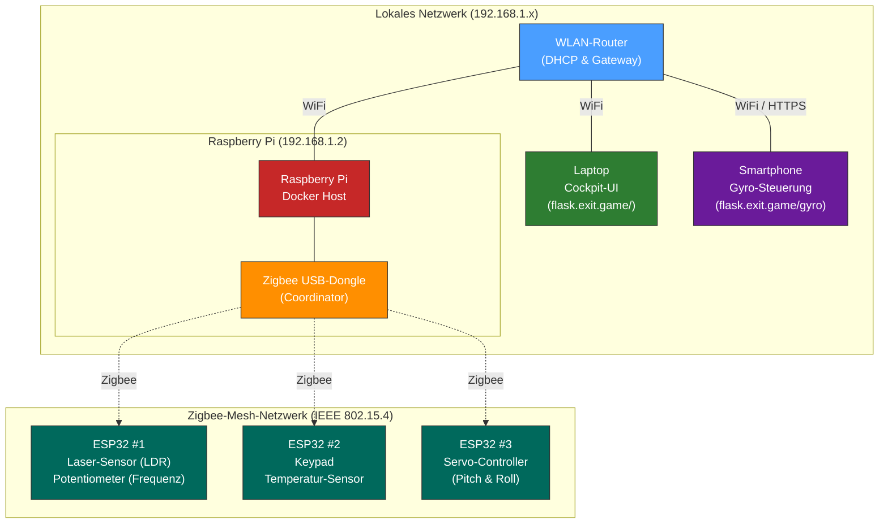
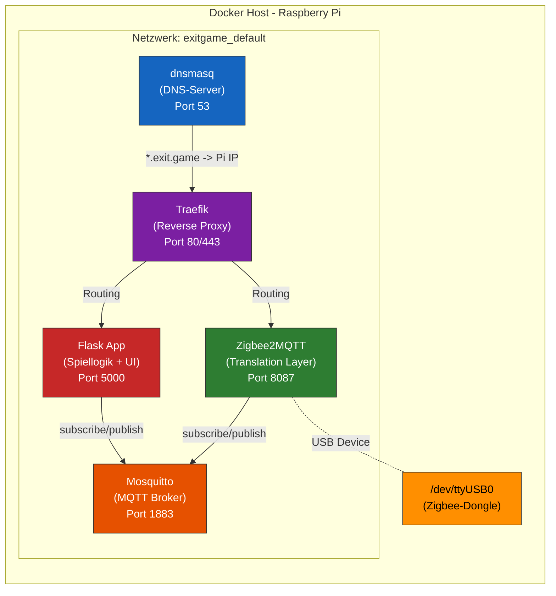
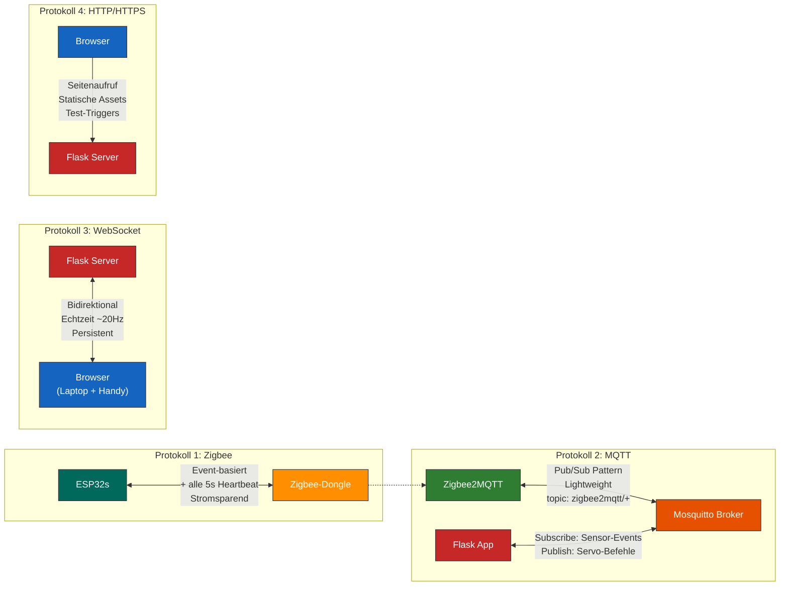
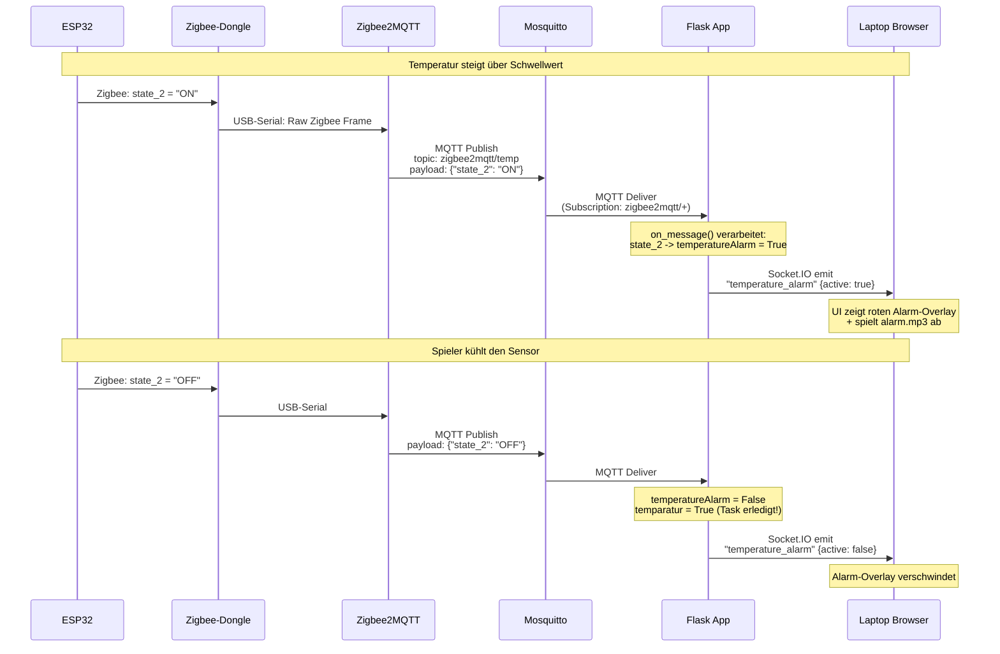
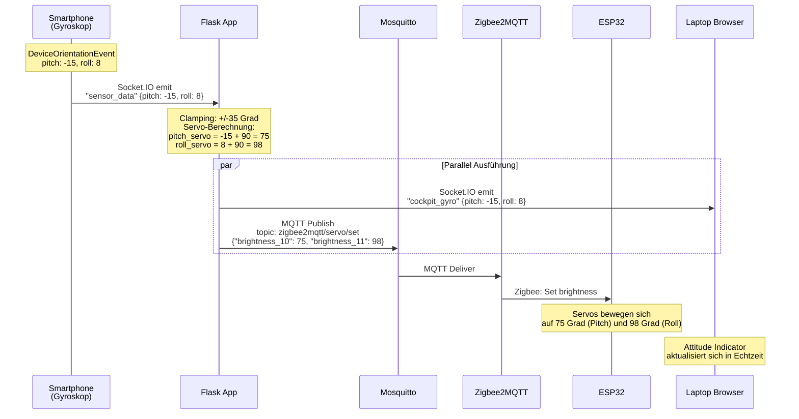
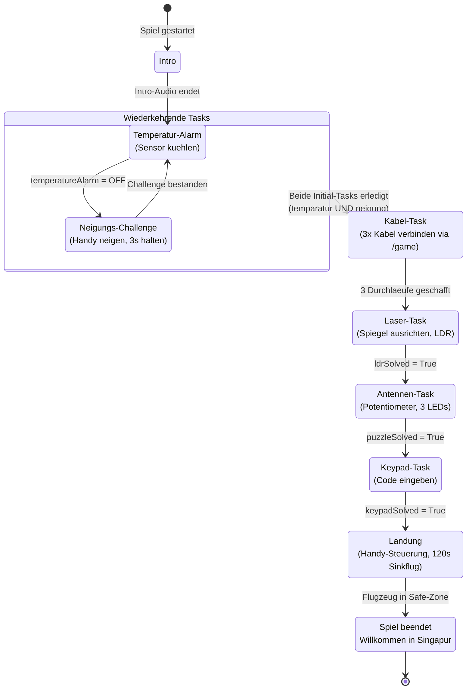

# Systemarchitektur – Flight Simulator Exit Game

## 1. Übersicht

Das Flight Simulator Exit Game ist ein IoT-basiertes Escape Room-Erlebnis, bei dem Spieler ein havariertes Flugzeug durch das Lösen physischer und digitaler Aufgaben sicher landen müssen. Die Architektur folgt dem **Edge-Gateway-Prinzip**: Ein Raspberry Pi fungiert als zentrale Schaltstelle zwischen der physischen Sensorwelt (ESP32-Mikrocontroller) und der digitalen Benutzeroberfläche (Webbrowser).

---

## 2. Netzwerktopologie

Das folgende Diagramm zeigt alle physischen Geräte und ihre Verbindungen im lokalen Netzwerk.



### Komponentenbeschreibung

| Komponente | Rolle | Verbindung |
|---|---|---|
| **WLAN-Router** | Stellt das lokale Netzwerk bereit, verbindet alle WiFi-Geräte | Zentral |
| **Raspberry Pi** | Edge-Gateway und Server: Hostet alle Docker-Container | WiFi zum Router, USB zum Zigbee-Dongle |
| **Zigbee-Dongle** | Coordinator des Zigbee-Mesh-Netzwerks | USB an Pi (`/dev/ttyUSB0`) |
| **Laptop** | User Interface: Zeigt das Cockpit-Dashboard an | WiFi → `flask.exit.game/` |
| **Smartphone** | Gyroskop-Eingabe: Sendet Neigungsdaten für Steuerung | WiFi → `flask.exit.game/gyro` |
| **ESP32 #1** | Sensoren: Laser (LDR) + Potentiometer (Frequenz-Puzzle) | Zigbee |
| **ESP32 #2** | Sensoren: Keypad + Temperatur-Alarm | Zigbee |
| **ESP32 #3** | Aktor: Servo-Motor für physische Flugzeugneigung | Zigbee |

---

## 3. Docker-Container-Architektur

Auf dem Raspberry Pi laufen fünf Docker-Container, die über `docker compose` orchestriert werden. Die Container kommunizieren über ein internes Docker-Netzwerk (`exitgame_default`).



### Container-Beschreibung

| Container | Image | Funktion |
|---|---|---|
| **dnsmasq** | `4km3/dnsmasq` | Löst `*.exit.game` auf die IP des Pi auf (`192.168.1.2`). Dadurch können Geräte im Netzwerk den Server über eine lesbare Domain erreichen. |
| **Traefik** | `traefik:latest` | Reverse Proxy mit automatischem HTTPS und HTTP→HTTPS-Redirect. Leitet Anfragen an `flask.exit.game` zum Flask-Container und `z2m.exit.game` zur Zigbee2MQTT-UI. |
| **Mosquitto** | `eclipse-mosquitto` | MQTT Message Broker. Zentraler Nachrichtenbus zwischen Zigbee2MQTT und der Flask-App. |
| **Zigbee2MQTT** | `koenkk/zigbee2mqtt` | Übersetzungsschicht: Wandelt rohe Zigbee-Telegramme in standardisierte MQTT-Nachrichten um (und umgekehrt). |
| **Flask App** | Custom Build | Kernlogik des Spiels: Verwaltet Spielzustand, empfängt Sensor-Events via MQTT, steuert Servos via MQTT, kommuniziert mit Browser-Clients via Socket.IO. |

---

## 4. Kommunikationsprotokolle

Das System nutzt vier verschiedene Protokolle, die jeweils für ihren spezifischen Einsatzzweck gewählt wurden.



### Warum welches Protokoll?

| Protokoll | Einsatzzweck | Begründung |
|---|---|---|
| **Zigbee** | ESP32 ↔ Raspberry Pi | Eigenes Mesh-Netzwerk, unabhängig vom WLAN. Stromsparend für batteriebetriebene Sensoren. Kein IP-Adressverbrauch im lokalen Netz. Stabil auch bei WLAN-Problemen. |
| **MQTT** | Zigbee2MQTT ↔ Flask App | Leichtgewichtiges Publish/Subscribe-Pattern. Ideal für IoT-Sensordaten, da der Broker Messages entkoppelt. Die Flask App muss nicht wissen, wie viele Sensoren es gibt – sie abonniert einfach `zigbee2mqtt/+`. |
| **WebSocket (Socket.IO)** | Flask App ↔ Browser | Persistente, bidirektionale Verbindung. Ermöglicht Echtzeit-Updates (Gyro-Daten mit ~20Hz, sofortige Alarm-Auslösung). Ohne WebSockets müsste der Browser ständig den Server pollen, was Latenz und Last verursachen würde. |
| **HTTP/HTTPS** | Browser → Flask App | Standard-Webprotokoll für das initiale Laden von HTML, CSS, JavaScript und Audio-Dateien. Wird auch für diskrete Aktionen genutzt (Test-Trigger via `/test-trigger`, Kabel-Task via `/game-complete`). |

---

## 5. Datenfluss – End-to-End-Beispiel

Das folgende Sequenzdiagramm zeigt den vollständigen Datenfluss am Beispiel des **Temperatur-Alarms**: Vom physischen Sensor über alle Schichten bis zur Benutzeroberfläche.



### Datenfluss: Gyroskop-Steuerung



---

## 6. Spielzustandsautomat

Das Spiel durchläuft eine feste Sequenz von Aufgaben. Der Zustandsautomat zeigt die Reihenfolge und die Bedingungen für den Übergang zwischen den Phasen.



---

## 7. Projektstruktur

```
Exit Game/
├── compose.yml                    # Docker Compose Orchestrierung
├── dnsmasq/
│   └── dnsmasq.conf               # DNS: *.exit.game → 192.168.1.2
├── mosquitto/
│   └── config/                    # Mosquitto MQTT Broker Konfiguration
├── zigbee2mqtt-data/              # Zigbee2MQTT Konfiguration & Gerätedatenbank
└── flask-app/
    ├── Dockerfile                 # Container-Build für Flask
    ├── requirements.txt           # Python: flask, flask-socketio, paho-mqtt, eventlet
    ├── app.py                     # Kernlogik: Spielzustand, MQTT, Socket.IO
    ├── templates/
    │   ├── base.html              # Basis-Template
    │   ├── index.html             # Cockpit-Dashboard (Hauptansicht)
    │   ├── game.html              # Kabel-Minispiel
    │   ├── gyro.html              # Gyroskop-Eingabeseite (Smartphone)
    │   └── landing.html           # Lande-Minispiel (Canvas-basiert)
    └── static/
        ├── css/                   # Stylesheets (Cockpit, Landing, etc.)
        ├── js/                    # Client-Logik (Socket.IO, Landing-Spiel, etc.)
        ├── audio/                 # Sprachaufnahmen + Soundeffekte (11 Dateien)
        └── img/                   # Bilder und Icons
```

---

## 8. Hardware & Firmware-Integration (ESP32)

Das System nutzt drei ESP32-Mikrocontroller, um die physischen Sensoren und Aktoren im Raum zu steuern. Anstatt aufwendig eigene Zigbee-Cluster von Grund auf neu zu programmieren, haben wir uns für einen sehr pragmatischen Lösungsansatz entschieden: Die ESP32-Boards geben sich im Netzwerk einfach als herkömmliche Smart-Home-Geräte aus.

### 8.1 Zweckentfremdung von Standard-Profilen
- **Statuswerte als smarte Steckdosen (`ZigbeePowerOutlet`)**: Einfache Ja/Nein-Zustände (wie "Rätsel gelöst" oder "Temperaturalarm aktiv") werden als smarte Steckdosen abgebildet. Wenn ein Rätsel gelöst ist, "schaltet" der ESP die virtuelle Steckdose ein. Zigbee2MQTT übersetzt das dann praktischerweise direkt in ein `{"state": "ON"}` für unseren MQTT-Broker.
- **Servowinkel als Lampenhelligkeit (`ZigbeeDimmableLight`)**: Um stufenlose numerische Werte an die Servos für das Flugzeug zu übermitteln, tun die ESPs so, als wären sie dimmbare Glühbirnen. Die Flask-App sendet einfach einen "Helligkeitswert" zwischen 0 und 254, den der Mikrocontroller dann direkt in den entsprechenden Winkel für den Servomotor umrechnet.

### 8.2 Firmware-Übersicht

| Mikrocontroller | Firmware-Ordner | Sensoren/Aktoren | Zigbee-Endpunkte |
|---|---|---|---|
| **ESP32 #1** | `Potentiometer-LDR_ESP-main` | 3x Potentiometer (Frequenz)<br>1x LDR (Laser)<br>Status-LEDs | EP 1: PowerOutlet (Frequenz gelöst)<br>EP 2: PowerOutlet (Laser gelöst) |
| **ESP32 #2** | `Keypad-TemperaturAlarm_ESP-main` | 4x4 Keypad<br>DHT22 Temperatur<br>Buzzer & LEDs | EP 1: PowerOutlet (Code korrekt)<br>EP 2: PowerOutlet (Temp-Alarm aktiv) |
| **ESP32 #3** | `Flugzeug-ESP-main` | 2x Servo-Motoren (Pitch & Roll) | EP 10: DimmableLight (Pitch)<br>EP 11: DimmableLight (Roll) |

### 8.3 Detail-Analyse: Die Bewegung des Modellflugzeugs
Ein zentrales Element der Immersion ist die physische Bewegung des Modellflugzeugs, die exakt den Neigungsbewegungen des Smartphones folgt. Dieser Prozess durchläuft alle Schichten der Architektur:

1. **Datenerfassung am Smartphone**: Der Browser des Smartphones nutzt die HTML5 `DeviceOrientationEvent`-API, um die physische Neigung des Geräts auszulesen. Da moderne Browser diese API aus Sicherheitsgründen nur über verschlüsselte Verbindungen erlauben, ist der Traefik-Reverse-Proxy mit TLS (HTTPS) hier zwingend erforderlich.
2. **Übertragung zum Server**: Die rohen Winkeldaten (Pitch und Roll) werden über eine persistente WebSocket-Verbindung (Socket.IO) an die Flask-App gesendet (`sensor_data`-Event). WebSockets verhindern den Overhead von HTTP-Polling und ermöglichen eine latenzfreie Übertragung.
3. **Verarbeitung in Flask**: Der Server nimmt die Winkel (z. B. -35° bis +35°) entgegen und zentriert sie (Addition von 90°), sodass 0° Neigung einem Servowinkel von 90° entspricht. Die Werte werden für das Zigbee-Netzwerk als Helligkeitswerte formatiert.
4. **MQTT zu Zigbee2MQTT**: Flask veröffentlicht einen MQTT-Payload (z. B. `{"brightness_10": 75, "brightness_11": 98}`) auf dem Topic `zigbee2mqtt/servo/set`.
5. **Zigbee-Übertragung**: Zigbee2MQTT empfängt die MQTT-Nachricht, übersetzt sie in das binäre Zigbee-Protokoll und sendet sie über den CC2652P USB-Dongle drahtlos an den ESP32 #3.
6. **Ausführung am ESP32**: Die Firmware (`Flugzeug.ino`) lauscht auf den Callbacks der virtuellen `ZigbeeDimmableLight`-Endpunkte. Sobald ein neuer "Helligkeitswert" eintrifft, wird dieser direkt an die `ESP32Servo`-Bibliothek übergeben, welche die PWM-Signale an GPIO 4 und 5 moduliert, um die physischen Servomotoren in die exakte Position zu steuern.

---

## 9. Design-Entscheidungen und ihre Begründung

### 9.1 Warum ein Raspberry Pi als Gateway?

Der Pi vereint **Rechenleistung** (für Flask + Docker), **USB-Ports** (für den Zigbee-Dongle) und **WiFi** (für die Netzwerkverbindung) in einem kompakten, kostengünstigen Gerät. Er fungiert als **Single Point of Truth** für den Spielzustand – alle Sensordaten laufen hier zusammen, alle Spielentscheidungen werden hier getroffen, alle Clients werden von hier aus gesteuert.

- **Kompakt & leise**: Der Pi kann unsichtbar im Escape Room verbaut werden – kein Lüfter, kein Lärm.
- **GPIO & USB**: Neben dem Zigbee-Dongle könnten bei Bedarf weitere Peripheriegeräte direkt angeschlossen werden.
- **Kosten**: Ein Raspberry Pi 4 kostet einen Bruchteil eines vollwertigen Servers und reicht für die Anforderungen dieses Projekts vollkommen aus.
- **Linux-basiert**: Docker, Git und alle benötigten Tools laufen nativ, ohne Kompromisse.

### 9.2 Warum Flask als Web-Framework?

Flask wurde bewusst als **Micro-Framework** gewählt, weil es genau die richtige Abstraktionsebene für dieses Projekt bietet:

- **Leichtgewichtig**: Flask bringt keinen Overhead mit. Für ein Escape-Room-Spiel mit einer Handvoll Routen wäre ein Full-Stack-Framework wie Django massiver Overkill.
- **Socket.IO-Integration**: Die Bibliothek `flask-socketio` integriert sich nahtlos und ermöglicht es, HTTP-Routen und WebSocket-Events in **einer einzigen Datei** (`app.py`) zu verwalten. Das hält die Architektur übersichtlich.
- **Python-Ökosystem**: Python bietet mit `paho-mqtt` eine ausgereifte MQTT-Client-Bibliothek. Die Kombination Flask + Socket.IO + Paho-MQTT deckt alle drei Kommunikationskanäle (HTTP, WebSocket, MQTT) in einer Sprache ab.
- **Rapid Prototyping**: Änderungen an der Spiellogik können direkt in `app.py` vorgenommen und sofort getestet werden, ohne Build-Schritte oder Kompilierung.

**Alternative wäre gewesen**: Node.js mit Express + Socket.IO. Dies hätte ähnliche Vorteile geboten, aber Python war die vertrautere Sprache im Team.

### 9.3 Warum Docker und warum genau diese Container?

Docker wurde eingesetzt, um das System **reproduzierbar und portabel** zu machen. Statt auf dem Raspberry Pi manuell Mosquitto, Zigbee2MQTT und Python-Abhängigkeiten zu installieren, definiert eine einzige `compose.yml` das gesamte System. Ein `docker compose up` startet alles.

Die fünf Container und ihre Begründung:

| Container | Warum genau dieser? |
|---|---|
| **Mosquitto** | Der De-facto-Standard für leichtgewichtige MQTT-Broker. Läuft stabil auf ARM-Architektur (Raspberry Pi) und benötigt minimale Ressourcen (~5 MB RAM). |
| **Zigbee2MQTT** | Abstrahiert die gesamte Zigbee-Komplexität. Ohne diesen Container müsste man selbst Zigbee-Frames parsen und Geräte-Pairing implementieren. Zigbee2MQTT übernimmt das und liefert saubere JSON-Nachrichten über MQTT. |
| **Traefik** | Löst ein kritisches Problem: Moderne Browser blockieren den Zugriff auf Gyroskop-Sensoren (`DeviceOrientationEvent`) über unverschlüsselte HTTP-Verbindungen. Traefik stellt automatisch HTTPS bereit, ohne dass manuell Zertifikate verwaltet werden müssen. |
| **dnsmasq** | Ermöglicht die Nutzung lesbarer Domains (`flask.exit.game`) statt kryptischer IP-Adressen. Das verbessert die User Experience und macht die Konfiguration auf verschiedenen Geräten einfacher. |
| **Flask App** | Custom-Build mit eigener `Dockerfile`. Wird als Container betrieben, damit Abhängigkeiten (eventlet, paho-mqtt) isoliert sind und auf dem Pi keine System-Python-Pakete kollidieren. |

**Vorteil der Containerisierung**: Wenn ein einzelner Dienst abstürzt (z.B. Zigbee2MQTT), starten die anderen Container unabhängig weiter. Die `restart: unless-stopped`-Policy sorgt für automatische Wiederherstellung.

### 9.4 Warum ein Smartphone statt eines dedizierten Gyroskop-Sensors?

Diese Entscheidung war eine der wirkungsvollsten des Projekts:

- **Keine zusätzliche Hardware**: Jeder Spieler hat bereits ein Smartphone mit präzisen Gyroskop- und Beschleunigungssensoren in der Tasche. Ein vergleichbarer externer Sensor (z.B. MPU6050 + ESP32) hätte zusätzliche Kosten, Verkabelung und Zigbee-Konfiguration erfordert.
- **Höhere Präzision**: Smartphone-Gyroskope sind ab Werk kalibriert und liefern hochfrequente, stabile Daten. Ein günstiger MPU6050 erfordert oft manuelle Kalibrierung und Drift-Kompensation.
- **Natürliche Interaktion**: Das physische Neigen eines Handys fühlt sich intuitiver an als das Drehen eines Potentiometers oder Joysticks. Es erzeugt ein immersives „Steuer-Gefühl", das perfekt zum Flugsimulator-Thema passt.
- **Dual-Use**: Dasselbe Smartphone dient sowohl für die **Neigungs-Challenges** (während des Hauptspiels) als auch für die **Landesteuerung** (im Finale). Zwei verschiedene Spielmechaniken mit einem einzigen Eingabegerät.

**Technischer Trick**: Da Browser die `DeviceOrientationEvent`-API nur über HTTPS freigeben, war der Traefik-Reverse-Proxy mit TLS eine zwingende Voraussetzung für diese Lösung.

### 9.5 Warum Zigbee statt WiFi für die ESP32-Sensoren?

- **Eigenes Netzwerk**: Die ESPs kommunizieren über ein separates Zigbee-Mesh und belasten nicht das WLAN, über das Laptop und Smartphone ihre WebSocket-Verbindungen halten.
- **Stromsparend**: Zigbee-Geräte können monatelang mit einer Batterie laufen. WiFi-basierte ESPs benötigen dagegen eine dauerhafte Stromversorgung.
- **Mesh-fähig**: Geräte können über andere Geräte kommunizieren, was die Reichweite im Raum verlängert.
- **Keine IP-Konfiguration**: Zigbee-Geräte werden über Zigbee2MQTT gepairt, nicht über DHCP. Das eliminiert eine ganze Klasse von Netzwerkproblemen.
- **Entkopplung**: Durch die MQTT-Abstraktionsschicht kann die Flask-App einfach `zigbee2mqtt/+` abonnieren, ohne zu wissen, wie viele Sensoren existieren oder wie das Zigbee-Protokoll intern funktioniert.

### 9.6 Warum Zigbee2MQTT als Übersetzungsschicht?

Zigbee2MQTT wurde bewusst als **Abstraktionslayer** zwischen der physischen Zigbee-Welt und der Anwendungslogik eingesetzt:

- **Standardisierung**: Egal ob ein ESP32 rohe Zigbee-Frames sendet oder ein kommerzieller Zigbee-Sensor genutzt wird – Zigbee2MQTT liefert immer sauberes JSON über MQTT-Topics.
- **Web-UI**: Zigbee2MQTT bietet unter `z2m.exit.game` eine grafische Oberfläche für Geräte-Management, Pairing und Debugging. Das hat die Entwicklung enorm beschleunigt.
- **Community-Support**: Mit über 3000 unterstützten Geräten und aktiver Entwicklung ist Zigbee2MQTT ein bewährtes Open-Source-Projekt, das regelmäßig Updates erhält.

### 9.7 Warum Socket.IO statt reinem HTTP-Polling?

Socket.IO baut eine **persistente, bidirektionale WebSocket-Verbindung** auf. Dies ist essenziell für:

- **Echtzeit-Gyro-Daten** (~5 Updates/Sekunde vom Smartphone): HTTP-Polling würde bei dieser Frequenz den Server überlasten und inakzeptable Latenz erzeugen.
- **Sofortige Alarm-Benachrichtigungen**: Wenn ein Sensor auslöst, muss das UI **sofort** reagieren. Bei HTTP-Polling würde es bis zur nächsten Abfrage dauern.
- **Server-initiierte Events**: Der Server kann jederzeit Subtitles, Challenges oder Spielzustandsänderungen an alle Clients pushen, ohne dass der Client danach fragen muss.
- **Automatische Reconnection**: Socket.IO verwaltet Verbindungsabbrüche und baut die Verbindung automatisch wieder auf – wichtig in einem WLAN-Umfeld mit möglichen kurzen Aussetzern.

### 9.8 Warum serverseitiger Spielzustand?

Der gesamte Spielzustand (welche Tasks erledigt sind, welche Challenge aktiv ist) wird zentral in der Flask-App verwaltet, nicht im Browser:

- **Single Source of Truth**: Egal ob der Laptop-Browser abstürzt oder das Handy die Verbindung verliert – der Spielstand bleibt erhalten. Bei Reconnect wird der aktuelle Zustand über das `initial_state`-Event synchronisiert.
- **Multi-Client-Synchronisation**: Laptop und Smartphone müssen denselben Spielzustand sehen. Serverseitige Verwaltung stellt sicher, dass es keine Inkonsistenzen gibt.
- **Hardware-Integration**: Nur der Server hat Zugriff auf den MQTT-Broker und kann Sensor-Events empfangen und Servo-Befehle senden. Der Browser hat keinen direkten Draht zur Hardware.

### 9.9 Warum Eventlet für Concurrency?

Die Flask-App muss **gleichzeitig** drei Dinge tun:
1. HTTP-Anfragen beantworten (Seitenaufruf)
2. WebSocket-Events verarbeiten (Gyro-Daten, Spielereignisse)
3. MQTT-Nachrichten empfangen (Sensor-Events)

Eventlet löst dieses Problem durch **kooperatives Multitasking** (Green Threads). Es „patcht" die Python-Standardbibliothek (`monkey_patch()`), sodass blockierende I/O-Operationen automatisch zu nicht-blockierenden werden. Dadurch können alle drei Aufgaben in einem einzigen Prozess laufen, ohne sich gegenseitig zu blockieren.

### 9.10 Warum ein eigener DNS-Server (dnsmasq)?

Statt den Spielern die IP-Adresse des Raspberry Pi mitzuteilen (z.B. `https://192.168.1.2:5000`), wird ein eigener DNS-Server betrieben, der alle Anfragen an `*.exit.game` auf die IP des Pi auflöst:

- **Benutzerfreundlichkeit**: `flask.exit.game` ist deutlich einprägsamer als eine IP-Adresse.
- **Flexibilität**: Falls sich die IP des Pi ändert, muss nur die `dnsmasq.conf` aktualisiert werden, nicht die Konfiguration auf jedem Endgerät.
- **Mehrere Dienste**: Traefik kann über die Domain-Regeln verschiedene Subdomains an verschiedene Container routen (`flask.exit.game` → Flask, `z2m.exit.game` → Zigbee2MQTT, `traefik.exit.game` → Dashboard).

